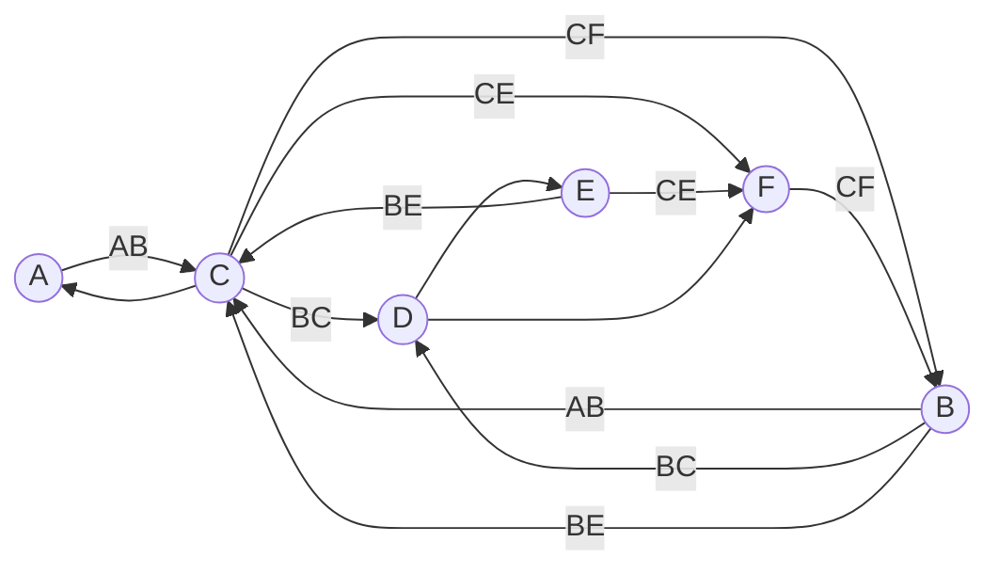

Here is the answer to **Question 6** in English.

**Question 6:**
Assume the relation schema $R(A, B, C, D, E, F)$ satisfies the following functional dependencies:
$F = \{ AB \to C, \ C \to A, \ BC \to D, \ ACD \to B, \ BE \to C, \ CE \to FA, \ CF \to BD, \ D \to EF \}$

**a) Find the Minimal Cover for this set of FDs.**

To find the Minimal Cover ($F_c$), we simplify the given set $F$ by splitting right-hand sides, removing extraneous attributes on the left-hand side, and removing redundant dependencies.

1.  **Split RHS:**
    $AB \to C$
    $C \to A$
    $BC \to D$
    $ACD \to B$
    $BE \to C$
    $CE \to F$
    $CE \to A$
    $CF \to B$
    $CF \to D$
    $D \to E$
    $D \to F$

2.  **Remove Redundant Attributes (LHS) & Redundant FDs:**
    *   **$CE \to A$**: Since $C \to A$ already exists, this dependency is redundant. **Remove.**
    *   **$ACD \to B$**: Check if $A$ is extraneous. If $CD \to B$:
        *   Using current FDs, $D \to E, F$. So $CD \to A$ (via $C \to A$) and $CD \to F$. Thus $CD \to CF$.
        *   Since $CF \to B$, we have $CD \to B$.
        *   Therefore, $A$ is extraneous. Replace $ACD \to B$ with **$CD \to B$**.
    *   **$CD \to B$**: Now check if this new FD is redundant given the others.
        *   From $CD$, we get $F$ (via $D \to F$) and $A$ (via $C \to A$).
        *   We have $CF \to B$.
        *   Therefore, $CD \to B$ is implied by $D \to F$ and $CF \to B$. **Remove.**
    *   **$CF \to D$**: Check if redundant.
        *   From $CF$, we get $B$ (via $CF \to B$).
        *   From $BC$, we get $D$ (via $BC \to D$).
        *   We have $C$ and $F$, so $CF \to B$ implies we have $B$ and $C$.
        *   Thus, $CF \to D$ is implied by $CF \to B$ and $BC \to D$. **Remove.**

3.  **Final Minimal Cover:**
    The remaining dependencies are:
    $$F_c = \{ AB \to C, \ C \to A, \ BC \to D, \ BE \to C, \ CE \to F, \ CF \to B, \ D \to E, \ D \to F \}$$

---

**b) Specify the Candidate Key(s).**

To find candidate keys, we determine the attribute closures. The attributes that are not on the Right-Hand Side (RHS) of any dependency are usually part of every key. Here, all attributes appear on the RHS, so we check combinations.

1.  **$BC$**:
    *   $BC \to D$ (given)
    *   $BC \to A$ (via $C \to A$)
    *   $BC \to E, F$ (via $D \to EF$)
    *   Closure: $\{A, B, C, D, E, F\}$ $\rightarrow$ **Candidate Key**
2.  **$CD$**:
    *   $CD \to A$ (via $C \to A$)
    *   $CD \to F$ (via $D \to F$)
    *   $CD \to B$ (via $CF \to B$)
    *   $CD \to E$ (via $D \to E$)
    *   Closure: $\{A, B, C, D, E, F\}$ $\rightarrow$ **Candidate Key**
3.  **$BD$**:
    *   $BD \to E, F$ (via $D \to EF$)
    *   $BD \to C$ (via $BE \to C$, using $E$ derived from $D$)
    *   $BD \to A$ (via $C \to A$)
    *   Closure: $\{A, B, C, D, E, F\}$ $\rightarrow$ **Candidate Key**
4.  **$CE$**:
    *   $CE \to F$ (given)
    *   $CE \to B$ (via $CF \to B$, using $F$)
    *   $CE \to D$ (via $BC \to D$, using $B$)
    *   $CE \to A$ (via $C \to A$)
    *   Closure: $\{A, B, C, D, E, F\}$ $\rightarrow$ **Candidate Key**
5.  **$CF$**:
    *   $CF \to B$ (given)
    *   $CF \to D$ (via $BC \to D$, using $B$)
    *   $CF \to E$ (via $D \to E$)
    *   $CF \to A$ (via $C \to A$)
    *   Closure: $\{A, B, C, D, E, F\}$ $\rightarrow$ **Candidate Key**

**Answer:** The Candidate Keys are **$BC, CD, BD, CE,$** and **$CF$**.

---

**c) Draw the Functional Dependency Graph.**

The graph below represents the Minimal Cover found in part (a).

*   **Vertices (Attributes):** A, B, C, D, E, F
*   **Edges (Dependencies):**
    *   $A, B \to C$
    *   $C \to A$
    *   $B, C \to D$
    *   $B, E \to C$
    *   $C, E \to F$
    *   $C, F \to B$
    *   $D \to E$
    *   $D \to F$

**Graphical Representation (Mermaid Syntax):**

*(Note: If using the original set F, you would also have edges for $ACD \to B$ and $CE \to A$, but the minimal cover graph above is the standard analysis representation.)*

---

**d) Calculate the closure of $\{A, C\}$ under this set of FDs.**

We compute $\{A, C\}^+$ iteratively:

1.  **Start:** $\{A, C\}$
2.  **Apply $C \to A$:** $A$ is already in the set. Result: $\{A, C\}$
3.  **Check other FDs:**
    *   $AB \to C$ (Need $B$)
    *   $BC \to D$ (Need $B$)
    *   $ACD \to B$ (Need $D$)
    *   $BE \to C$ (Need $B, E$)
    *   $CE \to FA$ (Need $E$)
    *   $CF \to BD$ (Need $F$)
    *   $D \to EF$ (Need $D$)

    None of the Left-Hand Side conditions are met by the current set $\{A, C\}$.

**Answer:** The closure of $\{A, C\}$ is **$\{A, C\}$**.